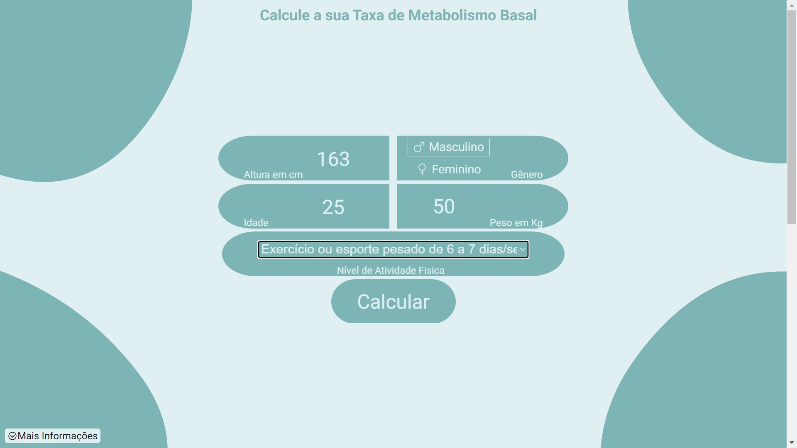

# Calcula Ae

Uma calculadora de Taxa Metabólica Basal(TMB) para descobrir de forma rápida e fácil quantas calorias em média é gasta.

### [Demo](https://calcula-ae.vercel.app/)

## Project Status

A primeira calculadora do projeto está finalizada, mas a ideia é adicionar várias calculadoras diferentes e que sejam uteis no dia a dia.

## Project Screen Shot(s)

## Installation and Setup Instructions

Clone este repositório. Você precisará de `node` e `npm` instalados globalmente em sua máquina.

Instalação:

`npm install`

Para iniciar o App:

`npm run dev`

## Reflection

O projeto foi desenvolvido usando Next js, React js, Javascript, HTML, CSS, SCSS e React-Icons. 

A primeira calculadora do projeto é uma calculadora de TMB, uma informação muito importante para quem esta planejando uma dieta tanto para ganho ou perda de peso. 

Pensei em fazer uma calculadora mais interativa e atrativa das demais que já utilizei na internet, desta forma poderia praticar minhas habilidades de programador e ter uma calculadora nova para estar acompanhando minha TMB.

